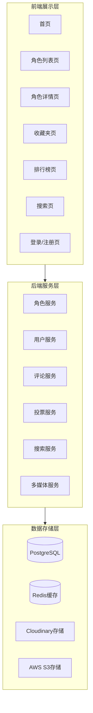
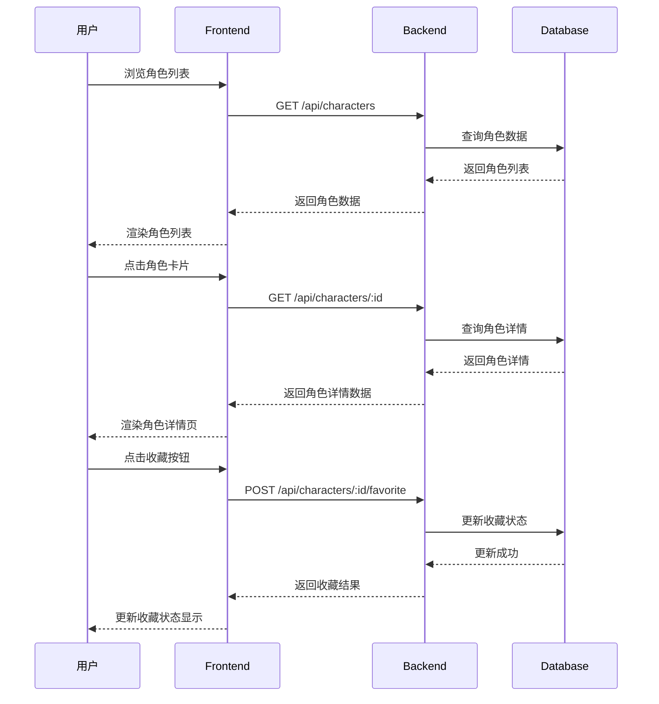
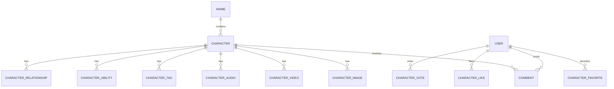

# 动漫角色介绍网站 - 概要设计文档

## 1. 引言

### 1.1 文档目的

本文档是基于《需求规格说明书》和《技术架构文档》编写的概要设计文档，旨在明确系统的总体结构、模块划分、数据结构和关键算法，为详细设计和编码实现提供指导。

### 1.2 文档范围

本文档涵盖以下内容：
- 系统总体结构设计
- 模块划分与接口设计
- 数据结构设计
- 关键算法设计
- 界面设计概要

### 1.3 参考文档

| 文档名称 | 版本 |
|----------|------|
| 动漫角色介绍网站需求规格说明书 | v1.0 |
| 动漫角色介绍网站产品需求文档 (PRD) | v1.0 |
| 动漫角色介绍网站技术架构文档 | v1.0 |

---

## 2. 系统总体结构设计

### 2.1 系统架构

系统采用经典的三层架构模式，分为前端展示层、后端服务层和数据存储层。



### 2.2 模块划分

系统按功能划分为以下核心模块：

| 模块名称 | 职责描述 | 包含子模块 |
|----------|----------|------------|
| 角色展示模块 | 角色信息展示与管理 | 角色列表、角色详情、角色卡片 |
| 用户交互模块 | 用户互动功能 | 收藏、点赞、评论、投票 |
| 多媒体模块 | 多媒体内容管理 | 图片画廊、音视频播放 |
| 搜索模块 | 全站搜索功能 | 关键词搜索、分类筛选 |
| 用户模块 | 用户管理 | 登录、注册、个人信息 |
| 导航模块 | 页面导航 | 顶部导航、面包屑、返回顶部 |

### 2.3 模块交互关系



---

## 3. 模块设计

### 3.1 角色展示模块

#### 3.1.1 模块职责

- 展示角色列表，支持分页、筛选和排序
- 展示角色详情，包含基础资料、设定、关系等
- 角色卡片展示，包含头像、名称、标签等信息

#### 3.1.2 子模块设计

**角色列表子模块**

| 功能 | 描述 | 输入 | 输出 |
|------|------|------|------|
| 列表查询 | 查询角色列表 | page, limit, sort, filter | 角色列表数据 |
| 分页处理 | 处理分页逻辑 | page, limit | 分页信息 |
| 筛选处理 | 处理筛选条件 | filter对象 | 筛选后的列表 |
| 排序处理 | 处理排序逻辑 | sort, order | 排序后的列表 |

**角色详情子模块**

| 功能 | 描述 | 输入 | 输出 |
|------|------|------|------|
| 详情查询 | 查询角色完整信息 | character_id | 角色详情数据 |
| 关联查询 | 查询关联数据（作品、声优等） | character_id | 关联数据 |
| 多媒体查询 | 查询图片、视频、音频 | character_id | 多媒体列表 |
| 关系查询 | 查询人物关系 | character_id | 关系列表 |

### 3.2 用户交互模块

#### 3.2.1 模块职责

- 角色收藏/取消收藏功能
- 角色点赞/取消点赞功能
- 评论发表、查看、点赞功能
- 角色投票功能

#### 3.2.2 子模块设计

**收藏子模块**

| 功能 | 描述 | 输入 | 输出 |
|------|------|------|------|
| 添加收藏 | 将角色添加到收藏夹 | user_id, character_id | 收藏状态 |
| 取消收藏 | 从收藏夹移除角色 | user_id, character_id | 收藏状态 |
| 查询收藏 | 查询用户收藏列表 | user_id | 收藏列表 |

**点赞子模块**

| 功能 | 描述 | 输入 | 输出 |
|------|------|------|------|
| 添加点赞 | 点赞角色 | user_id, character_id | 点赞状态 |
| 取消点赞 | 取消点赞 | user_id, character_id | 点赞状态 |

**评论子模块**

| 功能 | 描述 | 输入 | 输出 |
|------|------|------|------|
| 发表评论 | 发表角色评论 | user_id, character_id, content | 评论数据 |
| 查询评论 | 查询角色评论列表 | character_id | 评论列表 |
| 点赞评论 | 点赞评论 | user_id, comment_id | 点赞状态 |

**投票子模块**

| 功能 | 描述 | 输入 | 输出 |
|------|------|------|------|
| 投票 | 投票给角色 | user_id, character_id | 投票结果 |
| 查询排行 | 查询角色排行榜 | type, period | 排行榜数据 |
| 检查投票 | 检查用户今日是否已投票 | user_id, character_id | 投票状态 |

### 3.3 多媒体模块

#### 3.3.1 模块职责

- 图片上传、存储、展示
- 视频嵌入、播放
- 音频上传、播放
- 图片画廊展示

#### 3.3.2 子模块设计

**图片画廊子模块**

| 功能 | 描述 | 输入 | 输出 |
|------|------|------|------|
| 图片上传 | 上传角色图片 | file, character_id, type | 图片URL |
| 图片查询 | 查询角色图片列表 | character_id | 图片列表 |
| 图片分类 | 按类型筛选图片 | character_id, type | 分类图片列表 |

**音视频子模块**

| 功能 | 描述 | 输入 | 输出 |
|------|------|------|------|
| 音频上传 | 上传角色音频 | file, character_id, type | 音频URL |
| 音频查询 | 查询角色音频列表 | character_id | 音频列表 |
| 视频查询 | 查询角色视频列表 | character_id | 视频列表 |

### 3.4 搜索模块

#### 3.4.1 模块职责

- 全站关键词搜索
- 分类搜索（角色、作品）
- 搜索结果展示
- 搜索建议

#### 3.4.2 子模块设计

| 功能 | 描述 | 输入 | 输出 |
|------|------|------|------|
| 关键词搜索 | 按关键词搜索 | keyword, type | 搜索结果 |
| 角色搜索 | 搜索角色 | keyword | 角色列表 |
| 作品搜索 | 搜索作品 | keyword | 作品列表 |
| 搜索建议 | 提供搜索建议 | keyword | 建议列表 |

### 3.5 用户模块

#### 3.5.1 模块职责

- 用户注册、登录、登出
- 用户信息管理
- 收藏夹管理
- 权限管理

#### 3.5.2 子模块设计

**认证子模块**

| 功能 | 描述 | 输入 | 输出 |
|------|------|------|------|
| 用户注册 | 用户账号注册 | email, password, nickname | 用户数据 |
| 用户登录 | 用户账号登录 | email, password | JWT Token |
| 用户登出 | 用户账号登出 | token | 登出结果 |

**个人信息子模块**

| 功能 | 描述 | 输入 | 输出 |
|------|------|------|------|
| 获取用户信息 | 获取当前用户信息 | user_id | 用户信息 |
| 更新用户信息 | 更新用户昵称、头像 | user_id, data | 更新后用户信息 |

### 3.6 导航模块

#### 3.6.1 模块职责

- 顶部导航栏
- 面包屑导航
- 返回顶部按钮
- 移动端菜单

#### 3.6.2 子模块设计

| 功能 | 描述 | 输入 | 输出 |
|------|------|------|------|
| 导航渲染 | 渲染顶部导航 | 当前路由 | 导航组件 |
| 面包屑生成 | 生成面包屑路径 | 当前路由 | 面包屑组件 |
| 返回顶部 | 返回页面顶部 | 滚动位置 | 滚动事件 |

---

## 4. 数据结构设计

### 4.1 核心数据实体

#### 角色实体 (Character)

| 字段名 | 类型 | 说明 |
|--------|------|------|
| id | number | 角色ID |
| name | string | 角色中文名 |
| name_jp | string | 角色日文名 |
| name_romaji | string | 角色罗马音 |
| avatar_url | string | 头像URL |
| description | string | 角色概述 |
| personality | string | 性格特点 |
| appearance | string | 外貌特征 |
| background | string | 身份背景 |
| role_type | string | 角色定位 |
| birthday | string | 生日 |
| blood_type | string | 血型 |
| constellation | string | 星座 |
| height | string | 身高 |
| weight | string | 体重 |
| voice_actor_id | number | 声优ID |
| anime_id | number | 作品ID |
| likes_count | number | 点赞数 |
| favorites_count | number | 收藏数 |
| votes_count | number | 投票数 |

#### 作品实体 (Anime)

| 字段名 | 类型 | 说明 |
|--------|------|------|
| id | number | 作品ID |
| name | string | 作品中文名 |
| name_jp | string | 作品日文名 |
| studio | string | 制作公司 |
| release_date | string | 播出日期 |
| cover_url | string | 封面URL |
| description | string | 作品简介 |

#### 用户实体 (User)

| 字段名 | 类型 | 说明 |
|--------|------|------|
| id | number | 用户ID |
| email | string | 用户邮箱 |
| nickname | string | 用户昵称 |
| avatar_url | string | 用户头像 |
| supabase_id | string | Supabase认证ID |
| favorites_count | number | 收藏数 |

#### 评论实体 (Comment)

| 字段名 | 类型 | 说明 |
|--------|------|------|
| id | number | 评论ID |
| character_id | number | 角色ID |
| user_id | number | 用户ID |
| content | string | 评论内容 |
| likes_count | number | 点赞数 |

#### 收藏关联实体 (CharacterFavorite)

| 字段名 | 类型 | 说明 |
|--------|------|------|
| user_id | number | 用户ID |
| character_id | number | 角色ID |
| created_at | string | 收藏时间 |

#### 点赞关联实体 (CharacterLike)

| 字段名 | 类型 | 说明 |
|--------|------|------|
| user_id | number | 用户ID |
| character_id | number | 角色ID |

#### 投票关联实体 (CharacterVote)

| 字段名 | 类型 | 说明 |
|--------|------|------|
| user_id | number | 用户ID |
| character_id | number | 角色ID |
| vote_date | string | 投票日期 |

### 4.2 数据关系图



---

## 5. 关键算法设计

### 5.1 搜索算法

**搜索流程**:
1. 用户输入关键词
2. 对关键词进行分词处理
3. 在角色表和作品表中进行模糊匹配
4. 按匹配度排序
5. 返回搜索结果

**实现策略**:
- 使用 PostgreSQL 的 `ILIKE` 进行模糊搜索
- 对角色名、作品名建立全文索引
- 支持拼音搜索（可选）

### 5.2 排行榜算法

**排行计算流程**:
1. 根据排行类型（点赞/收藏/投票）选择对应字段
2. 根据时间周期筛选数据
3. 按数值降序排序
4. 计算排名

**时间周期筛选**:
- 本周: 筛选本周内的数据
- 本月: 筛选本月内的数据
- 全部: 筛选所有数据

### 5.3 分页算法

**分页计算**:
```
total_pages = ceil(total_count / limit)
offset = (page - 1) * limit
```

**分页策略**:
- 使用 PostgreSQL 的 `LIMIT` 和 `OFFSET`
- 支持自定义每页数量（10/20/50）
- 提供分页导航（上一页、下一页、页码跳转）

### 5.4 缓存策略

**热点数据缓存**:
- 热门角色列表缓存（5分钟）
- 排行榜数据缓存（10分钟）
- 用户收藏列表缓存（实时更新）

**缓存策略**:
- 使用 Redis 作为缓存层
- 数据更新时主动失效缓存
- 缓存穿透保护（空值缓存）

---

## 6. 界面设计概要

### 6.1 页面布局

| 页面 | 布局类型 | 主要区域 |
|------|----------|----------|
| 首页 | 上下结构 | Hero区、推荐区、更新区、分类区 |
| 角色列表页 | 左右结构 | 筛选栏、卡片网格 |
| 角色详情页 | 上下结构 | 头部、资料卡、设定、画廊、评论 |
| 收藏夹页 | 列表结构 | 收藏列表、空状态 |
| 排行榜页 | 列表结构 | 排行榜列表、投票区 |
| 搜索结果页 | 列表结构 | 搜索结果列表 |
| 登录/注册页 | 居中结构 | 登录/注册表单 |

### 6.2 设计规范

**色彩规范**:
- 主色调: 紫色系（#6B21A8, #8B5CF6）
- 辅助色: 粉色（#EC4899）、青色（#06B6D4）
- 背景色: 浅灰（#F8FAFC）、白色（#FFFFFF）

**字体规范**:
- 中文: Noto Sans SC
- 英文: Roboto
- 标题: 加粗，18-24px
- 正文: 常规，14-16px
- 辅助文字: 常规，12px

**间距规范**:
- 页面边距: 24px（桌面）/ 16px（移动端）
- 卡片间距: 16px
- 内容间距: 8-12px

---

## 7. 接口设计概要

### 7.1 前端接口

| 接口名称 | 方法 | 路径 | 说明 |
|----------|------|------|------|
| 获取角色列表 | GET | /api/characters | 获取角色列表 |
| 获取角色详情 | GET | /api/characters/:id | 获取角色详情 |
| 点赞角色 | POST | /api/characters/:id/like | 点赞角色 |
| 收藏角色 | POST | /api/characters/:id/favorite | 收藏角色 |
| 获取评论列表 | GET | /api/characters/:id/comments | 获取评论列表 |
| 发表评论 | POST | /api/characters/:id/comments | 发表评论 |
| 获取排行榜 | GET | /api/ranking | 获取排行榜 |
| 投票 | POST | /api/characters/:id/vote | 投票 |
| 搜索 | GET | /api/search | 全站搜索 |
| 获取用户信息 | GET | /api/users/me | 获取用户信息 |
| 用户登录 | POST | /api/auth/login | 用户登录 |
| 用户注册 | POST | /api/auth/register | 用户注册 |

### 7.2 内部接口

| 接口名称 | 调用方 | 被调用方 | 说明 |
|----------|--------|----------|------|
| 查询角色数据 | CharacterService | CharacterRepository | 查询角色 |
| 查询用户数据 | UserService | UserRepository | 查询用户 |
| 查询评论数据 | CommentService | CommentRepository | 查询评论 |
| 更新计数 | CharacterService | Database | 更新点赞/收藏数 |
| 缓存操作 | Service层 | Redis | 缓存读写 |

---

## 8. 安全性设计

### 8.1 认证安全

- 使用 JWT Token 进行身份认证
- Token 设置过期时间（24小时）
- 支持 Token 刷新机制
- 密码加密存储（bcrypt）

### 8.2 数据安全

- 评论内容敏感词过滤
- 防止 SQL 注入（使用 ORM 参数化查询）
- 防止 XSS 攻击（前端转义）
- 文件上传类型校验

### 8.3 访问控制

- API 请求频率限制
- 角色权限控制
- 敏感操作二次验证

---

**文档版本**: v1.0  
**创建日期**: 2026年7月21日  
**适用项目**: 动漫角色介绍网站