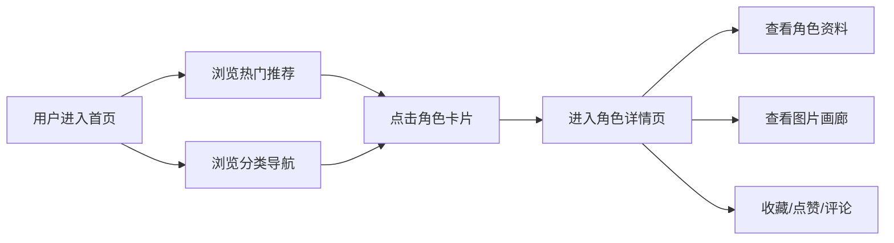
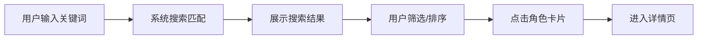
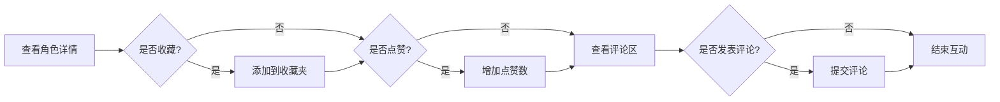

# 动漫角色介绍网站 - 产品需求文档 (PRD)

## 1. 产品概述

本产品是一个专业的动漫角色介绍网站，为动漫爱好者提供集中展示、了解和交流动漫角色的平台。通过高质量视觉设计和丰富内容，打造沉浸式角色浏览体验，连接动漫创作者与粉丝群体。

- **核心目标**: 建立动漫角色信息百科，提供多媒体内容展示，促进用户社区互动
- **目标用户**: 动漫爱好者、角色研究者、同人创作者、普通浏览用户
- **市场价值**: 填补中文动漫角色资料整合空白，打造权威的角色信息平台

---

## 2. 核心功能

### 2.1 用户角色

| 角色 | 注册方式 | 核心权限 |
|------|----------|----------|
| 普通用户 | 邮箱/手机号注册 | 浏览角色、收藏、点赞、评论、投票 |
| 内容管理员 | 后台管理账号 | 角色资料维护、审核评论、内容发布 |

### 2.2 功能模块

1. **首页**: 轮播图、热门角色推荐、最新更新、分类导航
2. **角色列表页**: 角色卡片列表、分类筛选、搜索功能、分页
3. **角色详情页**: 角色基础资料、设定展示、剧情关系、多媒体画廊、评论区
4. **收藏夹页**: 用户收藏的角色列表、收藏管理
5. **排行榜页**: 角色人气排行、投票功能
6. **搜索结果页**: 搜索结果展示、高级筛选

### 2.3 页面详细功能

| 页面名称 | 模块名称 | 功能描述 |
|----------|----------|----------|
| 首页 | Hero轮播区 | 自动轮播展示热门角色/作品，支持手动切换，点击跳转详情 |
| 首页 | 热门角色推荐 | 展示按点赞/收藏排序的热门角色卡片，支持查看更多 |
| 首页 | 最新更新 | 展示最近新增/更新的角色列表，按时间排序 |
| 首页 | 分类导航 | 按作品、属性标签分类，快速筛选入口 |
| 角色列表页 | 角色卡片 | 展示角色头像、名称、所属作品、标签，支持点击查看详情 |
| 角色列表页 | 筛选功能 | 按作品、属性类型、角色定位等条件筛选 |
| 角色列表页 | 搜索框 | 支持按角色名、作品名搜索 |
| 角色列表页 | 分页 | 分页展示，支持每页数量切换 |
| 角色详情页 | 基础资料卡 | 展示角色名称（日/中/罗马音）、头像、作品信息、标签 |
| 角色详情页 | 角色档案 | 生日、血型、星座、身高、体重、声优等信息 |
| 角色详情页 | 设定展示 | 性格特点、外貌特征、身份背景、能力技能列表 |
| 角色详情页 | 剧情关系 | 剧情简介、人物关系网展示 |
| 角色详情页 | 图片画廊 | 官方立绘、动画截图、壁纸下载，支持轮播 |
| 角色详情页 | 音视频 | 角色主题曲、台词播放、出场片段 |
| 角色详情页 | 互动区 | 收藏、点赞、分享、评论区功能 |
| 收藏夹页 | 收藏列表 | 展示用户收藏的所有角色，支持批量管理 |
| 收藏夹页 | 管理功能 | 删除收藏、创建收藏分组 |
| 排行榜页 | 人气排行 | 按点赞数/收藏数/投票数排序展示角色 |
| 排行榜页 | 投票功能 | 用户对角色进行投票，支持每日/每周投票限制 |
| 搜索结果页 | 结果展示 | 搜索匹配的角色列表，支持按相关度排序 |
| 搜索结果页 | 高级筛选 | 在搜索结果基础上进一步筛选 |

---

## 3. 核心流程

### 3.1 用户浏览流程

用户进入首页 → 浏览热门推荐/分类导航 → 点击角色卡片 → 进入详情页查看完整信息 → 进行收藏/点赞/评论操作

### 3.2 用户搜索流程

用户输入关键词 → 系统搜索匹配 → 展示搜索结果 → 用户筛选/排序 → 点击进入详情

### 3.3 用户互动流程

用户查看角色详情 → 点击收藏/点赞 → 查看评论区 → 发表评论

---

## 4. 用户界面设计

### 4.1 设计风格

- **主色调**: 紫色系（#6B21A8 主色，#8B5CF6 辅色），搭配渐变效果，体现动漫梦幻感
- **辅助色**: 粉色（#EC4899）用于强调互动元素，青色（#06B6D4）用于信息提示
- **按钮风格**: 圆角设计（border-radius: 8px），hover状态有缩放和阴影效果
- **字体**: 中文使用"Noto Sans SC"，英文使用"Roboto"，标题加粗处理
- **布局风格**: 卡片式布局，信息层次分明，留白舒适
- **图标**: 使用 Heroicons，风格简洁现代

### 4.2 页面设计概述

| 页面名称 | 模块名称 | UI元素描述 |
|----------|----------|------------|
| 首页 | Hero轮播 | 全屏轮播图，渐变遮罩层，底部标题文字，自动切换动画 |
| 首页 | 角色卡片 | 圆角卡片，上方头像图，下方名称和标签，hover上浮效果 |
| 角色详情页 | 头部区域 | 角色立绘背景图，渐变遮罩，角色名称叠加展示 |
| 角色详情页 | 资料卡 | 网格布局，图标+文字组合，标签使用pill样式 |
| 角色详情页 | 图片画廊 | 瀑布流/网格布局，点击图片放大预览 |
| 角色详情页 | 评论区 | 评论卡片列表，底部评论输入框 |

### 4.3 响应式设计

- **桌面端（>1200px）**: 完整多列布局，侧边栏信息展示
- **平板端（768px-1200px）**: 双列布局，适当缩小间距
- **移动端（<768px）**: 单列布局，顶部导航转为汉堡菜单，图片自适应宽度
- **触控优化**: 按钮点击区域≥44px，图片支持手势缩放，滑动切换画廊

### 4.4 动画效果

- 页面加载: 淡入效果 + 元素依次出现动画
- 卡片hover: 上浮+阴影加深
- 图片画廊: 平滑过渡切换
- 点赞/收藏: 点击时缩放动画 + 数字递增动画
- 轮播图: 平滑滑动切换

---

## 5. 非功能需求

### 5.1 性能需求
- 首屏加载时间 ≤ 2.5秒
- 图片懒加载，渐进式加载
- 列表页支持虚拟滚动（超过50条）
- API响应时间 ≤ 500ms

### 5.2 兼容性需求
- 支持 Chrome 90+、Firefox 88+、Safari 14+、Edge 90+
- 移动端适配 iOS 12+、Android 10+

### 5.3 安全性需求
- 评论内容敏感词过滤
- 用户数据加密存储
- 防止SQL注入和XSS攻击
- API请求频率限制

---

**文档版本**: v1.0  
**创建日期**: 2026年7月21日  
**适用项目**: 动漫角色介绍网站