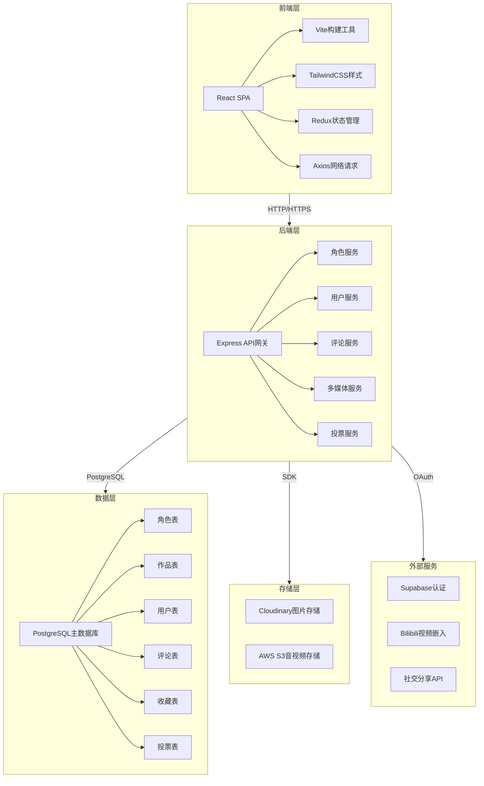
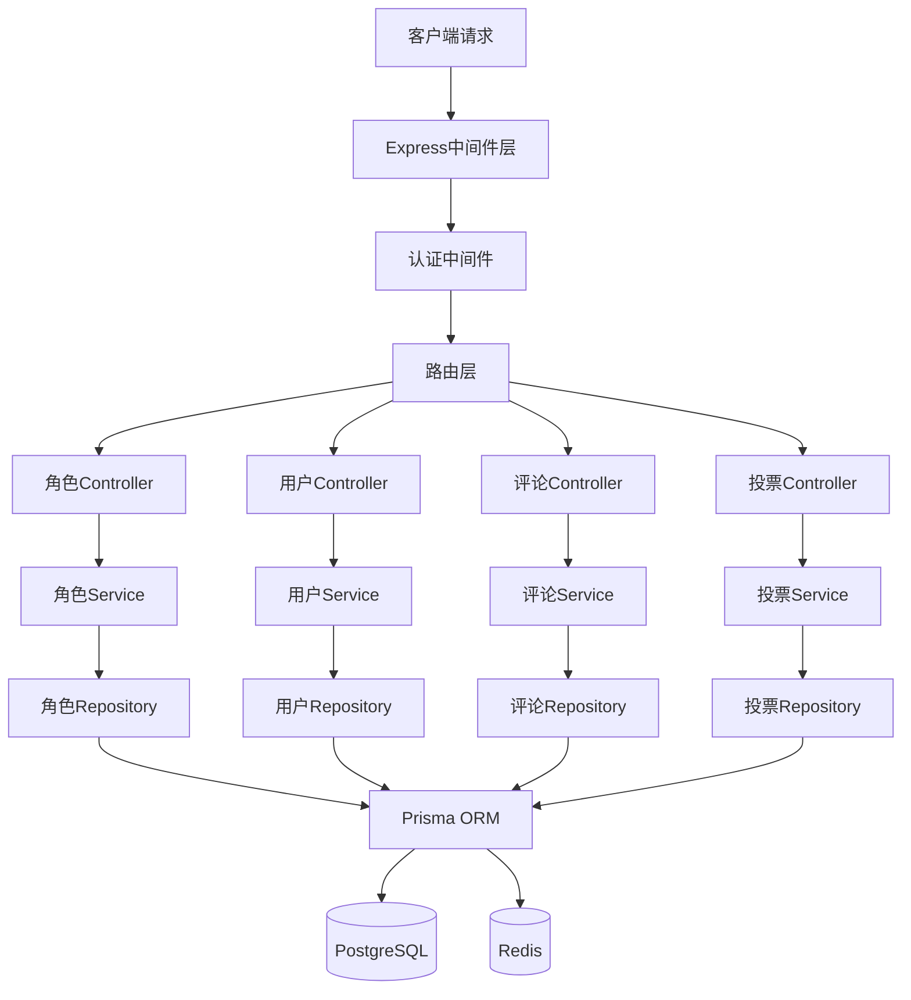

# 动漫角色介绍网站 - 技术架构文档

## 1. 架构设计



**架构说明**:
- 采用经典的三层架构（前端-后端-数据）
- 前端使用React SPA，通过Vite构建优化开发体验
- 后端使用Express作为API网关，业务逻辑分层为独立服务
- 数据库使用PostgreSQL，保证数据一致性和查询性能
- 多媒体文件分离存储到Cloudinary和S3，减轻数据库压力
- 用户认证委托给Supabase，简化开发

---

## 2. 技术栈描述

### 2.1 前端技术栈

| 分类 | 技术 | 版本 | 用途 |
|------|------|------|------|
| 框架 | React | 18.x | 前端页面组件化开发 |
| 构建工具 | Vite | 5.x | 快速开发构建和热更新 |
| 样式 | TailwindCSS | 3.x | 原子化CSS，快速样式开发 |
| 状态管理 | Redux Toolkit | 2.x | 全局状态管理 |
| 路由 | React Router | 6.x | 单页应用路由管理 |
| 网络请求 | Axios | 1.x | HTTP请求封装 |
| 动画 | Framer Motion | 11.x | 页面过渡和交互动画 |
| 图标 | Heroicons | 2.x | 现代化图标库 |
| 图片画廊 | react-image-gallery | 1.x | 图片轮播展示 |
| 日期处理 | date-fns | 3.x | 日期格式化和计算 |

### 2.2 后端技术栈

| 分类 | 技术 | 版本 | 用途 |
|------|------|------|------|
| 框架 | Express | 4.x | API网关和路由管理 |
| 语言 | Node.js | 20.x | 后端运行时 |
| ORM | Prisma | 5.x | 数据库访问层 |
| 认证 | Supabase Auth | 2.x | 用户认证和权限管理 |
| 文件上传 | Multer | 1.x | 文件上传处理 |
| 图片处理 | Sharp | 0.33.x | 图片压缩和格式转换 |
| API文档 | Swagger | 4.x | API接口文档生成 |
| 验证 | Joi | 17.x | 请求参数验证 |
| 日志 | Winston | 3.x | 日志记录 |

### 2.3 数据库与存储

| 分类 | 技术 | 用途 |
|------|------|------|
| 主数据库 | PostgreSQL | 结构化数据存储（角色、用户、评论等） |
| 图片存储 | Cloudinary | 角色立绘、截图、头像存储和CDN分发 |
| 音视频存储 | AWS S3 | 音频文件和视频文件存储 |
| 缓存 | Redis | 热门角色数据缓存、投票计数缓存 |

### 2.4 第三方服务

| 服务 | 用途 |
|------|------|
| Supabase | 用户认证（邮箱/手机号登录、OAuth） |
| Bilibili API | 视频嵌入和播放 |
| ShareSDK | 社交平台分享（微信、微博、QQ） |
| Cloudflare CDN | 静态资源加速分发 |

---

## 3. 路由定义

### 3.1 前端路由

| 路由 | 组件 | 用途 |
|------|------|------|
| `/` | HomePage | 首页，展示热门推荐和分类导航 |
| `/characters` | CharacterList | 角色列表页，支持筛选和搜索 |
| `/characters/:id` | CharacterDetail | 角色详情页，展示完整角色信息 |
| `/favorites` | FavoritesPage | 用户收藏夹页面 |
| `/ranking` | RankingPage | 角色排行榜和投票页面 |
| `/search?q=xxx` | SearchPage | 搜索结果页面 |
| `/login` | LoginPage | 用户登录页面 |
| `/register` | RegisterPage | 用户注册页面 |

### 3.2 路由守卫

- `/favorites`: 需要用户登录
- `/login`, `/register`: 已登录用户重定向到首页
- 其他路由：公开访问

---

## 4. API定义

### 4.1 角色相关接口

#### GET /api/characters
获取角色列表

**请求参数**:
| 参数 | 类型 | 必填 | 说明 |
|------|------|------|------|
| page | number | 否 | 页码，默认1 |
| limit | number | 否 | 每页数量，默认20 |
| sort | string | 否 | 排序字段：popular/updated/name |
| filter | object | 否 | 筛选条件 |
| filter.anime_id | number | 否 | 作品ID |
| filter.tags | string[] | 否 | 标签数组 |
| filter.type | string | 否 | 角色类型 |

**响应**:
```typescript
{
  data: Array<{
    id: number;
    name: string;
    name_jp: string;
    name_romaji: string;
    avatar_url: string;
    anime: { id: number; name: string; cover_url: string };
    tags: string[];
    likes_count: number;
    favorites_count: number;
    updated_at: string;
  }>;
  pagination: {
    current_page: number;
    total_pages: number;
    total_count: number;
  };
}
```

#### GET /api/characters/:id
获取角色详情

**响应**:
```typescript
{
  id: number;
  name: string;
  name_jp: string;
  name_romaji: string;
  avatar_url: string;
  description: string;
  personality: string;
  appearance: string;
  background: string;
  role_type: string;
  birthday: string;
  blood_type: string;
  constellation: string;
  height: string;
  weight: string;
  voice_actor: string;
  abilities: Array<{ name: string; description: string }>;
  weapons: Array<{ name: string; description: string }>;
  anime: {
    id: number;
    name: string;
    name_jp: string;
    studio: string;
    release_date: string;
    cover_url: string;
  };
  tags: string[];
  images: Array<{ id: number; url: string; type: string; caption: string }>;
  videos: Array<{ id: number; url: string; type: string; title: string }>;
  audios: Array<{ id: number; url: string; type: string; title: string }>;
  relationships: Array<{
    id: number;
    character_id: number;
    character_name: string;
    type: string;
  }>;
  likes_count: number;
  favorites_count: number;
  is_liked: boolean;
  is_favorited: boolean;
  created_at: string;
  updated_at: string;
}
```

#### POST /api/characters/:id/like
点赞角色

**响应**:
```typescript
{ success: boolean; likes_count: number }
```

#### POST /api/characters/:id/favorite
收藏/取消收藏角色

**响应**:
```typescript
{ success: boolean; is_favorited: boolean; favorites_count: number }
```

### 4.2 评论相关接口

#### GET /api/characters/:id/comments
获取角色评论列表

**请求参数**:
| 参数 | 类型 | 必填 | 说明 |
|------|------|------|------|
| page | number | 否 | 页码，默认1 |
| limit | number | 否 | 每页数量，默认10 |

**响应**:
```typescript
{
  data: Array<{
    id: number;
    content: string;
    user: { id: number; nickname: string; avatar_url: string };
    likes_count: number;
    is_liked: boolean;
    created_at: string;
  }>;
  pagination: { current_page: number; total_pages: number };
}
```

#### POST /api/characters/:id/comments
发表评论

**请求体**:
```typescript
{ content: string }
```

**响应**:
```typescript
{ success: boolean; comment: Comment }
```

### 4.3 投票相关接口

#### GET /api/ranking
获取角色排行榜

**请求参数**:
| 参数 | 类型 | 必填 | 说明 |
|------|------|------|------|
| type | string | 否 | 排行类型：likes/favorites/votes |
| period | string | 否 | 时间周期：week/month/all |

**响应**:
```typescript
{
  data: Array<{
    rank: number;
    character_id: number;
    name: string;
    avatar_url: string;
    score: number;
    anime_name: string;
  }>;
}
```

#### POST /api/characters/:id/vote
投票给角色

**响应**:
```typescript
{ success: boolean; vote_count: number; rank: number }
```

### 4.4 用户相关接口

#### GET /api/users/me
获取当前用户信息

**响应**:
```typescript
{
  id: number;
  email: string;
  nickname: string;
  avatar_url: string;
  favorites_count: number;
  created_at: string;
}
```

#### GET /api/users/me/favorites
获取用户收藏列表

**响应**:
```typescript
{
  data: Array<{
    id: number;
    character_id: number;
    name: string;
    avatar_url: string;
    anime_name: string;
    favorited_at: string;
  }>;
}
```

### 4.5 搜索接口

#### GET /api/search
全站搜索

**请求参数**:
| 参数 | 类型 | 必填 | 说明 |
|------|------|------|------|
| q | string | 是 | 搜索关键词 |
| type | string | 否 | 搜索类型：character/anime/all |

**响应**:
```typescript
{
  characters: Array<{ id: number; name: string; avatar_url: string }>;
  anime: Array<{ id: number; name: string; cover_url: string }>;
}
```

---

## 5. 服务器架构



**分层说明**:
1. **中间件层**: 处理认证、日志、错误捕获
2. **路由层**: 定义API端点和请求分发
3. **Controller层**: 处理请求参数验证和响应格式
4. **Service层**: 业务逻辑处理，事务管理
5. **Repository层**: 数据访问封装，与Prisma交互
6. **数据层**: PostgreSQL存储持久化数据，Redis缓存热点数据

---

## 6. 目录结构

### 6.1 前端目录

```
frontend/
├── public/                    # 静态资源
│   ├── favicon.ico
│   └── index.html
├── src/
│   ├── components/            # 通用组件
│   │   ├── Layout/           # 布局组件
│   │   ├── Card/             # 卡片组件
│   │   ├── Button/           # 按钮组件
│   │   ├── Input/            # 输入组件
│   │   └── Icon/             # 图标组件
│   ├── pages/                # 页面组件
│   │   ├── HomePage.tsx
│   │   ├── CharacterList.tsx
│   │   ├── CharacterDetail.tsx
│   │   ├── FavoritesPage.tsx
│   │   ├── RankingPage.tsx
│   │   ├── SearchPage.tsx
│   │   ├── LoginPage.tsx
│   │   └── RegisterPage.tsx
│   ├── features/             # Redux状态管理
│   │   ├── characters/       # 角色状态
│   │   ├── users/            # 用户状态
│   │   ├── comments/         # 评论状态
│   │   └── favorites/        # 收藏状态
│   ├── services/             # API服务层
│   │   ├── api.ts            # Axios实例
│   │   ├── characters.ts     # 角色API
│   │   ├── users.ts          # 用户API
│   │   └── comments.ts       # 评论API
│   ├── types/                # TypeScript类型定义
│   │   └── index.ts
│   ├── utils/                # 工具函数
│   ├── hooks/                # 自定义Hooks
│   ├── styles/               # 全局样式
│   │   └── index.css
│   ├── App.tsx               # 根组件
│   ├── main.tsx              # 入口文件
│   └── routes.tsx            # 路由配置
├── vite.config.ts            # Vite配置
├── tailwind.config.ts        # TailwindCSS配置
├── tsconfig.json             # TypeScript配置
└── package.json
```

### 6.2 后端目录

```
backend/
├── src/
│   ├── app.ts                # Express应用入口
│   ├── server.ts             # 服务器启动
│   ├── middleware/           # 中间件
│   │   ├── auth.ts           # 认证中间件
│   │   ├── logger.ts         # 日志中间件
│   │   └── error.ts          # 错误处理中间件
│   ├── routes/               # 路由定义
│   │   ├── characters.ts     # 角色路由
│   │   ├── users.ts          # 用户路由
│   │   ├── comments.ts       # 评论路由
│   │   ├── ranking.ts        # 排行榜路由
│   │   └── search.ts         # 搜索路由
│   ├── controllers/          # 控制器
│   │   ├── characterController.ts
│   │   ├── userController.ts
│   │   ├── commentController.ts
│   │   └── rankingController.ts
│   ├── services/             # 服务层
│   │   ├── characterService.ts
│   │   ├── userService.ts
│   │   ├── commentService.ts
│   │   └── rankingService.ts
│   ├── repositories/         # 数据访问层
│   │   ├── characterRepository.ts
│   │   ├── userRepository.ts
│   │   ├── commentRepository.ts
│   │   └── voteRepository.ts
│   ├── validation/           # 验证规则
│   │   └── schemas.ts
│   ├── config/               # 配置文件
│   │   ├── database.ts       # 数据库配置
│   │   ├── storage.ts        # 存储配置
│   │   └── supabase.ts       # Supabase配置
│   └── types/                # TypeScript类型
├── prisma/                   # Prisma ORM
│   └── schema.prisma         # 数据库模型
├── swagger/                  # API文档
│   └── swagger.json
├── .env                      # 环境变量
├── tsconfig.json
└── package.json
```

---

**文档版本**: v1.0  
**创建日期**: 2026年7月21日  
**适用项目**: 动漫角色介绍网站